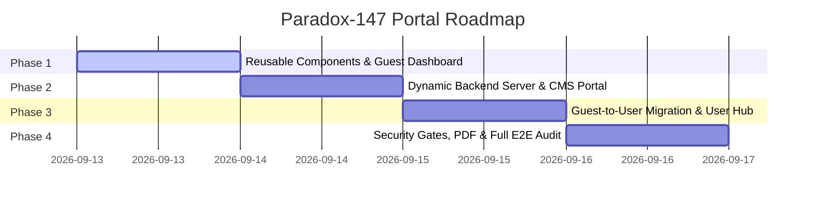

# Paradox-147 — Project Roadmap & Phase Milestones
**Department of Physics • Rajshahi College, Rajshahi**

---

## Milestone Release Plan

---

### Phase 1: Reusable Component Engine & Guest Dashboard
- **File Spec**: [phase-1.md](file:///c:/Users/iamna/OneDrive/Desktop/Paradoxian/phase-1.md)
- **Deliverables**:
  - Reusable Header component (`js/components/header.js`)
  - Reusable Footer component (`js/components/footer.js`)
  - Reusable Toast alert component (`js/components/toast.js`)
  - Interactive Guest Dashboard page (`guest-dashboard.html` & `js/guest-dashboard.js`)
  - Refactoring global pages to mount reusable components
- **Status**: Ready for execution upon approval

### Phase 2: Dynamic Backend Architecture & CMS Admin Portal
- **File Spec**: [phase-2.md](file:///c:/Users/iamna/OneDrive/Desktop/Paradoxian/phase-2.md)
- **Deliverables**:
  - Node.js / Express REST API application (`server/server.js`)
  - Persistent JSON database store (`server/data/*.json`)
  - Universal Dual-Mode API Client (`js/api.js`)
  - Automated Student Password Recovery with Official Gmail SMTP Engine (`mail.paradox147@gmail.com` via Google App Password)
  - Refined login navigation removing top registration tab while retaining bottom verification trigger
  - Dynamic Notices CMS & Weekly Routine CMS editor
  - Verification request processing desk
- **Status**: In Progress (Backend Server & Password Recovery Engine Complete)

### Phase 3: Guest-to-User Migration Engine & Authenticated Dashboard
- **File Spec**: [phase-3.md](file:///c:/Users/iamna/OneDrive/Desktop/Paradoxian/phase-3.md)
- **Deliverables**:
  - Guest-to-User Migration Controller (`js/migration/guest-migration.js`)
  - Auto-migration trigger upon student login / verification approval
  - Migration celebration dialog & toast notification
  - Student dashboard personal resources tab (saved notices, routine, notes)
- **Status**: Planned

### Phase 4: Security Gates, PDF Roster Engine & Comprehensive Verification
- **File Spec**: [phase-4.md](file:///c:/Users/iamna/OneDrive/Desktop/Paradoxian/phase-4.md)
- **Deliverables**:
  - Public vs Student privacy filter enforcement
  - Column-wise official PDF roster export (Roll & Reg sorting)
  - End-to-end automated test suites
  - Exhaustive maintenance guide and code comments
- **Status**: Planned
