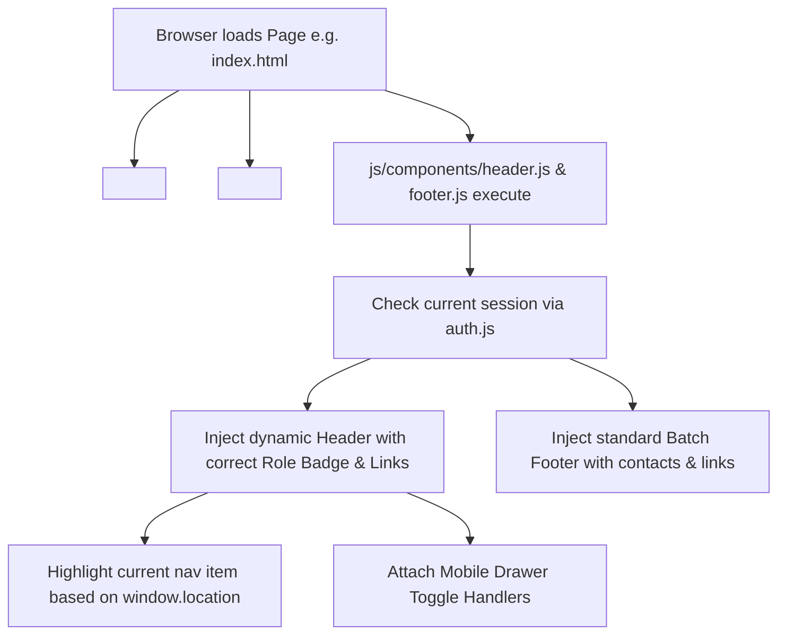
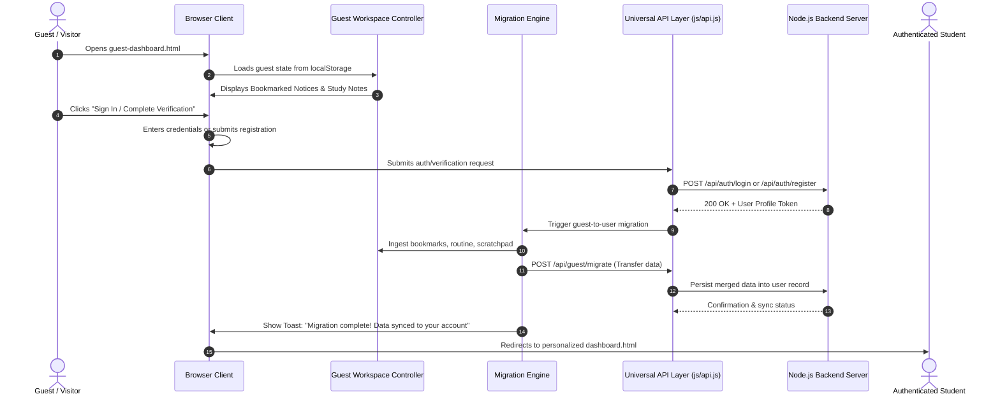

# Paradox-147 — System Architecture & Path Management Diagram
**Department of Physics • Rajshahi College, Rajshahi**  
*The 147th Honours Batch (2024-25 Session)*

---

## 1. Directory Tree & File Management Path Diagram

```
Paradoxian/
├── .planning/                          # GSD Project Management & State Engine
│   ├── config.json                     # GSD configuration & workflow flags
│   ├── PROJECT.md                      # High-level project charter & goals
│   ├── REQUIREMENTS.md                 # Traceable requirements matrix
│   ├── ROADMAP.md                      # Milestone & phase release tracking
│   └── STATE.md                        # Active context & synchronization memory
│
├── design.md                           # Comprehensive System Design Specification
├── architecture.md                     # File Management Architecture & Path Diagram
├── phase-1.md                          # Phase 1: Modular Components & Guest Dashboard
├── phase-2.md                          # Phase 2: Dynamic Backend & CMS Admin Portal
├── phase-3.md                          # Phase 3: Migration Engine & Full User Hub
├── phase-4.md                          # Phase 4: Security Gates, PDF & Verification
│
├── server/                             # Dynamic Backend Service Layer (Node.js/Express)
│   ├── server.js                       # Primary HTTP/REST API Application Server
│   ├── package.json                    # Backend dependencies & npm run dev scripts
│   ├── data/                           # Persistent JSON Database / Data Store
│   │   ├── students.json               # Student profiles, credentials & privacy flags
│   │   ├── notices.json                # Official batch notices & announcements
│   │   ├── routine.json                # Weekly lecture, tutorial & lab schedule
│   │   ├── gallery.json                # Campus & lab photograph records
│   │   └── treasury.json               # Batch financial metrics & transactions
│   ├── routes/                         # Modular REST API Route Handlers
│   │   ├── auth.routes.js              # /api/auth (Login, Verify, Register, Session)
│   │   ├── students.routes.js          # /api/students (Public view vs Authenticated)
│   │   ├── notices.routes.js           # /api/notices (CRUD & pin actions)
│   │   ├── routine.routes.js           # /api/routine (Schedule CRUD)
│   │   ├── guest.routes.js             # /api/guest (Sync, telemetry & migration)
│   │   └── admin.routes.js             # /api/admin (CMS operations, Roster PDF data)
│   └── middleware/                     # Backend Security & Context Middleware
│       ├── auth.guard.js               # Token / Role Verification Guard
│       └── privacy.filter.js           # Strips sensitive data for public requests
│
├── assets/                             # Static Assets & Media
│   └── images/                         # Official Logos & Vectors
│       ├── batch-logo.png              # Primary official crest
│       ├── batch-logo.jpg              # High-res photo variant
│       ├── favicon.png                 # Browser tab favicon
│       └── campus-hero-bg.svg          # Dynamic physics grid backdrop
│
├── css/                                # Global Styling & Design Tokens
│   └── style.css                       # Complete CSS design system & micro-animations
│
├── js/                                 # Frontend Logic & Reusable Component Library
│   ├── components/                     # REUSABLE UI COMPONENTS (Zero duplication)
│   │   ├── header.js                   # Universal Reusable Header Component
│   │   ├── footer.js                   # Universal Reusable Footer Component
│   │   ├── toast.js                    # Reusable Notification & Alert Toast Engine
│   │   └── modal.js                    # Reusable Modal Dialog Manager
│   ├── migration/                      # GUEST-TO-USER DATA MIGRATION ENGINE
│   │   └── guest-migration.js          # Ingests guest state, syncs with user profile
│   ├── api.js                          # Universal API Client (Backend + Local fallback)
│   ├── auth.js                         # Authentication controller (Student & Admin)
│   ├── dashboard.js                    # Student & Admin Dashboard Engine
│   ├── guest-dashboard.js              # Dedicated Guest Workspace Controller
│   ├── data.js                         # Seed fallback data & schema defaults
│   ├── directory.js                    # Student Directory & Public Privacy Controller
│   ├── notices.js                      # Notices & Circulars Controller
│   ├── gallery.js                      # Campus Gallery Controller
│   ├── main.js                         # Global bootstrap & page initializer
│   └── vendor/                         # Local vendor libraries
│       ├── jspdf.umd.min.js            # Offline PDF Generator Core
│       └── jspdf.plugin.autotable.min.js # Tabular Roster PDF Plugin
│
├── index.html                          # Homepage & Batch Identity Showcase
├── guest-dashboard.html                # Interactive Guest Hub & Planner
├── dashboard.html                      # Authenticated Student & Admin Cockpit
├── login.html                          # Sign In, Student Verification & Admin Auth
├── students.html                       # Student Directory & Privacy-Gated Profiles
├── notices.html                        # Academic Circulars & Event Schedules
├── gallery.html                        # Batch Memories & Physics Lab Showcase
└── test-admin-editable.js              # Automated Node test: Admin CMS CRUD
```

---

## 2. Reusable Component Lifecycle Architecture

To maintain high efficiency and clean code across multiple pages without server-side templating or bulky frameworks, we implement a **lightweight Custom Component Loader**:



### Component Injection Pattern:
In any page (e.g. `index.html`, `guest-dashboard.html`, `students.html`), the markup requires only:
```html
<!-- Reusable Header Mount Point -->
<div id="batch-header-mount"></div>

<!-- Page Specific Body Content -->
<main id="main-content"> ... </main>

<!-- Reusable Footer Mount Point -->
<div id="batch-footer-mount"></div>

<!-- Component Scripts Loaded in Footer -->
<script src="js/components/header.js"></script>
<script src="js/components/footer.js"></script>
```

---

## 3. Data Flow & Communication Architecture



---

## 4. API Endpoints Map

| Method | Endpoint | Description | Access Level |
|---|---|---|---|
| `GET` | `/api/health` | System health check & uptime | Public |
| `GET` | `/api/students/public` | Get sanitized student list (Public privacy rule) | Public |
| `GET` | `/api/students/all` | Get complete student profiles & contacts | Authenticated Student |
| `POST` | `/api/students/verify` | Submit new student verification request | Guest / Unverified |
| `POST` | `/api/auth/login` | Authenticate Student or Administrator | Public |
| `GET` | `/api/auth/session` | Get current logged-in user profile | Authenticated |
| `POST` | `/api/auth/logout` | Terminate session | Authenticated |
| `POST` | `/api/guest/migrate` | Transfer guest bookmarks & notes to user | Authenticated |
| `GET` | `/api/notices` | Retrieve all active batch notices | Public |
| `POST` | `/api/notices` | Create new batch notice | Admin Only |
| `PUT` | `/api/notices/:id` | Update existing notice | Admin Only |
| `DELETE`| `/api/notices/:id` | Remove notice | Admin Only |
| `GET` | `/api/routine` | Retrieve weekly schedule & labs | Public |
| `PUT` | `/api/routine` | Update or replace routine items | Admin Only |
| `GET` | `/api/admin/pending` | List pending student verification requests | Admin Only |
| `PUT` | `/api/admin/approve/:id` | Approve student verification request | Admin Only |
| `PUT` | `/api/admin/reject/:id` | Reject student verification request | Admin Only |
| `GET` | `/api/admin/roster-export` | Get formatted data for PDF roster export | Admin Only |

---

## 5. Maintenance Guidelines & Documentation Principles

To guarantee that any future maintainer or student CR can update this codebase effortlessly:
1. **Header Docstrings**: Every module starts with an ASCII header defining its purpose, author, dependencies, and lifecycle.
2. **Method JSDocs**: All asynchronous API functions declare `@param`, `@returns`, and `@throws`.
3. **State Isolation**: Guest keys (`paradox147_guest_*`) and authenticated keys (`paradox147_current_user_*`) are strictly separated to prevent accidental state contamination.
4. **Graceful Degradation**: If the Node.js backend server is not running (e.g. opened directly from file system or a static host like GitHub Pages), the Universal API client automatically falls back to `localStorage` mode without errors.
